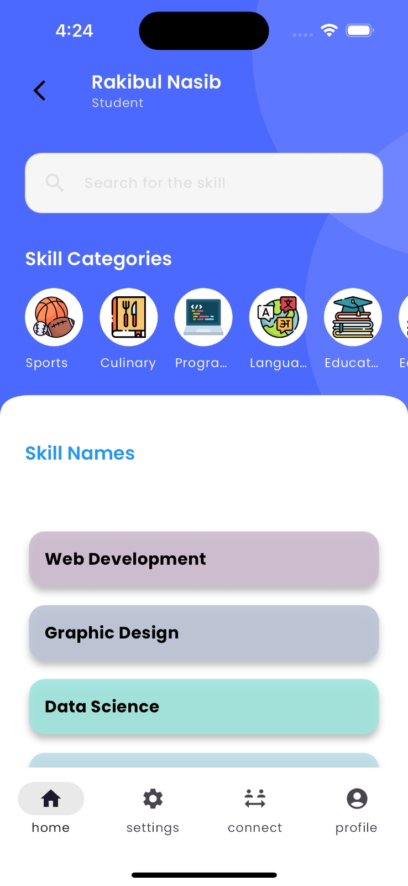
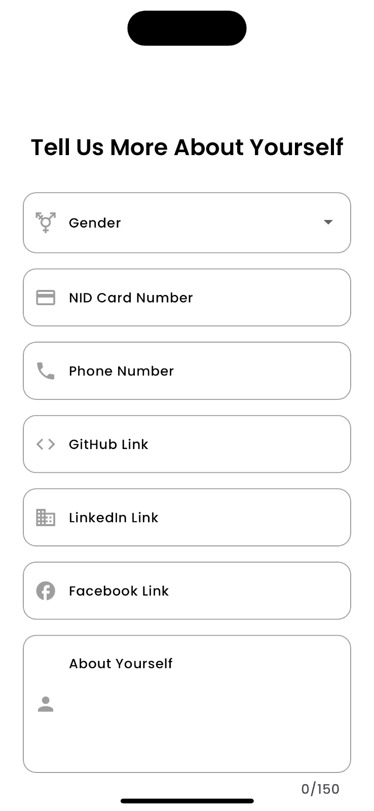
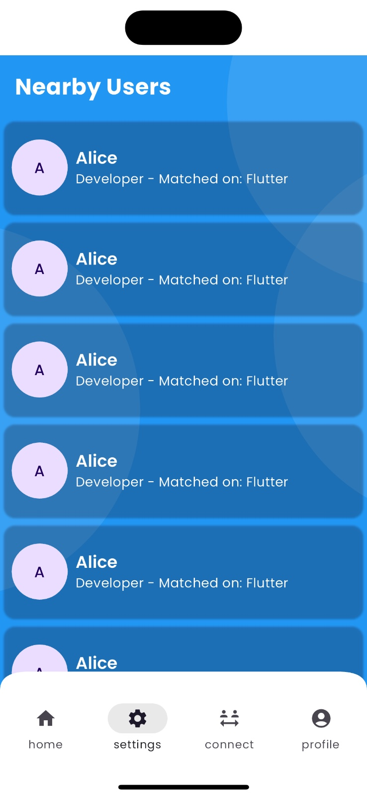
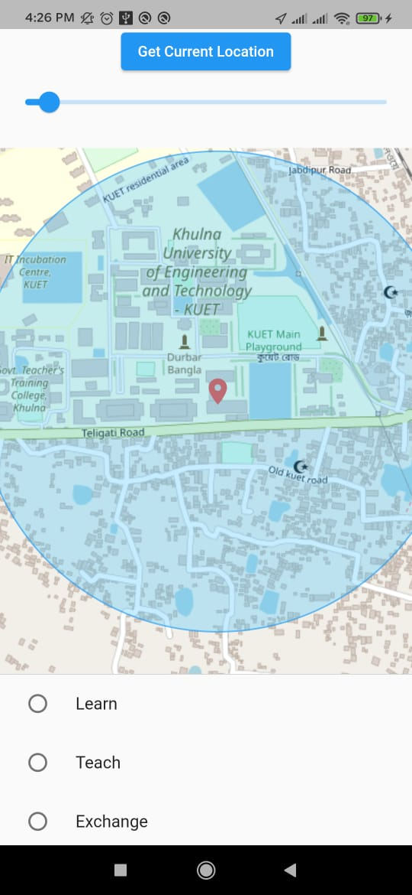

# SkillSwap – An Interactive App for Exchanging Skills

## Overview
SkillSwap is an innovative mobile application designed to connect people with complementary skill sets, allowing them to exchange knowledge and help each other grow. The platform enables users to find nearby individuals who possess the skills they want to learn and vice versa.

## Features
- **User Profile Creation**: Users can list their skills, interests, and location.
- **Skill Matching**: The app matches users based on complementary skill sets.
- **Location-Based Search**: Users can find skill partners in their nearby area.
- **Multiple Learning Modes**: Users can choose to teach, learn, swap skills, or practice together.
- **Feedback and Rating System**: Users can leave ratings and reviews for skill exchanges. (Under development)

## Technologies Used
- **Frontend**: Flutter (Dart)
- **Backend**: Firebase (Firestore Database, Authentication, Cloud Storage)
- **Location Services**: Google Maps API, Geolocator
- **Development Tools**: Android Studio, VS Code

## Screenshots
| Skill Home | User Info | Nearby Users | Location |
|-------------|------------|------------|------------|
|  |  |  |  |

## System Architecture
SkillSwap consists of:
- **User Module**: Handles authentication, profiles, and skill listing.
- **Matching Module**: Matches users based on location and skills.
- **Communication Module**: Enables real-time chat and interactions.
- **Feedback System**: Users can leave ratings and reviews.

## Future Improvements
- Implement a **verification system** for user skills.
- Introduce **AI-based recommendations** for better matches.
- Improve performance for large datasets by optimizing queries.
- Expand support for **more languages and regions**.

## Contributors
- **Rakibul Nasib**
- **Samin Saiara**
- **Supervisor**: Abdul Aziz, Assistant Professor, KUET
